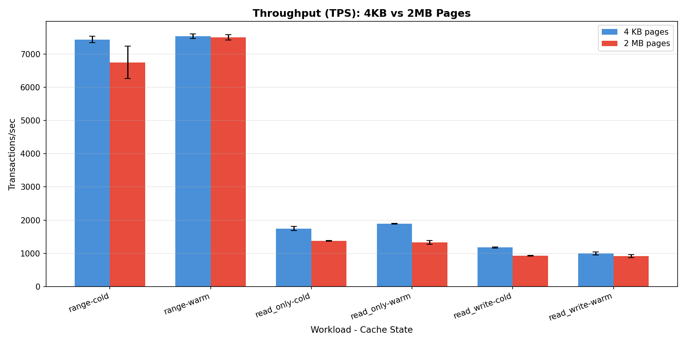
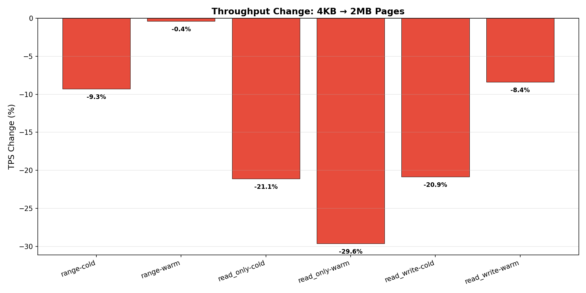
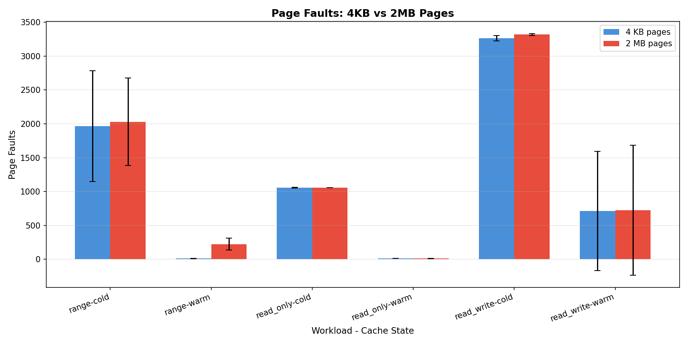
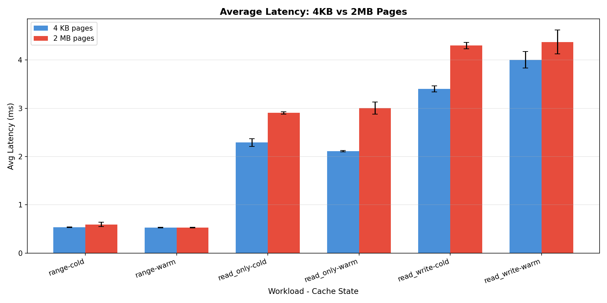
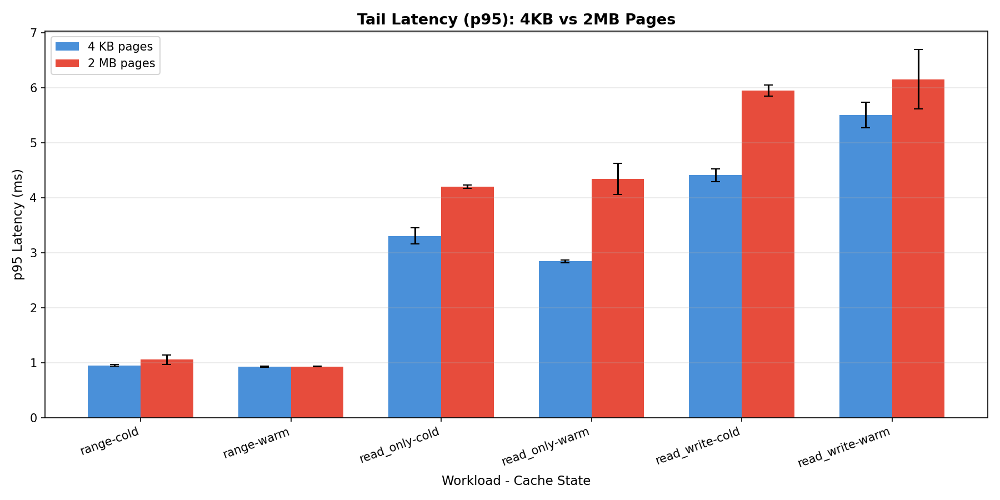
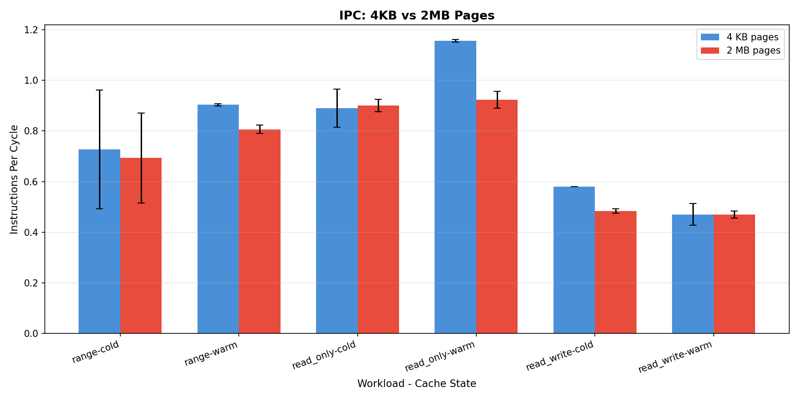
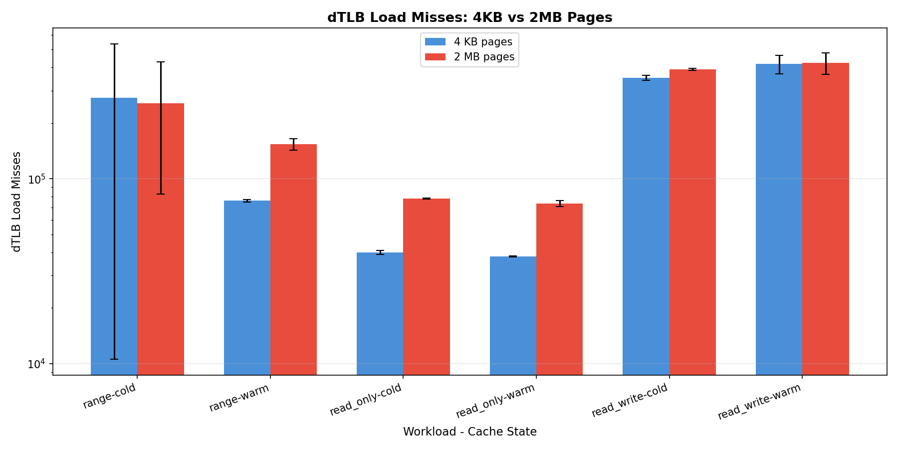
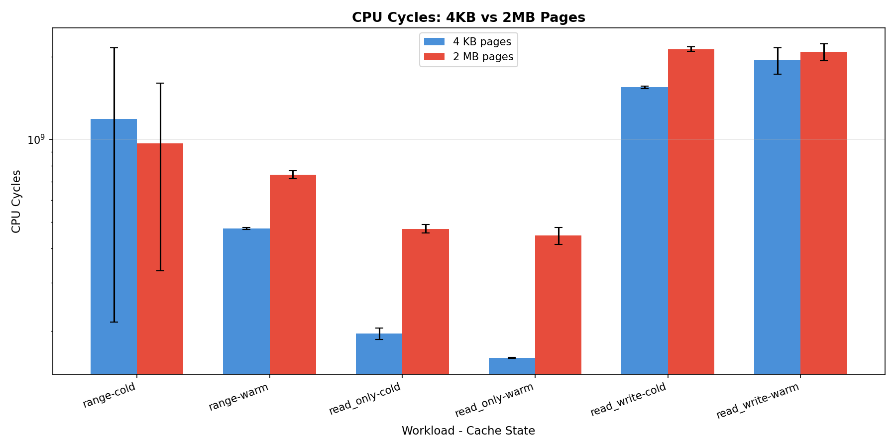

# Database Workload — Experiment Findings

## Experimental Setup

| Parameter | Value |
|---|---|
| **System** | Linux 6.17.0-19-generic, 16 GB RAM, 8 cores |
| **Cache hierarchy** | L1=32KB, L2=256KB, L3=8MB |
| **Database** | PostgreSQL 16 |
| **Benchmark** | sysbench 1.0.20 OLTP |
| **Dataset** | 4 tables × 1,000,000 rows (~1.5 GB) |
| **Page configs** | 4 KB (THP=never) vs 2 MB (THP=always) |
| **Instrumentation** | `perf stat` on PostgreSQL backend PIDs + sysbench output |
| **Duration** | 60 seconds per run, 4 threads |
| **Repetitions** | 3 per configuration |
| **Total runs** | 36 (3 workloads × 2 page configs × 2 cache states × 3 reps) |

### Workloads Tested
- **Read-only (OLTP)** — 14 SELECT queries per transaction (point lookups + range queries)
- **Read-write (OLTP)** — SELECT, UPDATE, INSERT, DELETE (20 queries per transaction)
- **Range scan** — Range queries over contiguous key ranges (100-row ranges)
- **Cold cache** — OS page cache dropped + PostgreSQL restarted
- **Warm cache** — Pre-warmed with initial sysbench run

---

## Summary Results

| Config | TPS | QPS | Avg Latency (ms) | p95 Latency (ms) | Page Faults | IPC |
|---|---:|---:|---:|---:|---:|---:|
| **read_only-4KB-cold** | 1,745 | 27,913 | 2.29 | 3.31 | 1,060 | 0.89 |
| **read_only-2MB-cold** | 1,376 | 22,023 | 2.90 | 4.20 | 1,058 | 0.90 |
| **read_only-4KB-warm** | 1,891 | 30,259 | 2.11 | 2.84 | 13 | 1.16 |
| **read_only-2MB-warm** | 1,331 | 21,291 | 3.01 | 4.34 | 12 | 0.92 |
| **read_write-4KB-cold** | 1,175 | 23,504 | 3.40 | 4.41 | 3,262 | 0.58 |
| **read_write-2MB-cold** | 930 | 18,601 | 4.30 | 5.95 | 3,317 | 0.48 |
| **read_write-4KB-warm** | 1,000 | 20,005 | 4.00 | 5.51 | 715 | 0.47 |
| **read_write-2MB-warm** | 916 | 18,326 | 4.37 | 6.15 | 723 | 0.47 |
| **range-4KB-cold** | 7,434 | 22,301 | 0.54 | 0.95 | 1,965 | 0.73 |
| **range-2MB-cold** | 6,743 | 20,230 | 0.59 | 1.05 | 2,030 | 0.69 |
| **range-4KB-warm** | 7,531 | 22,592 | 0.53 | 0.93 | 13 | 0.90 |
| **range-2MB-warm** | 7,502 | 22,505 | 0.53 | 0.93 | 224 | 0.81 |

---

## Key Findings

### 1. 4KB Pages Outperform 2MB Pages for Most Database Workloads

| Workload | 4KB TPS | 2MB TPS | 4KB Advantage |
|---|---:|---:|---:|
| Read-only, cold | 1,745 | 1,376 | **+27%** |
| Read-only, warm | 1,891 | 1,331 | **+42%** |
| Read-write, cold | 1,175 | 930 | **+26%** |
| Read-write, warm | 1,000 | 916 | **+9%** |
| Range, cold | 7,434 | 6,743 | **+10%** |
| Range, warm | 7,531 | 7,502 | **+0.4%** |

4KB pages provide a meaningful throughput advantage for point lookup workloads (read-only, read-write), with the gap widening in warm cache scenarios. Range scan workloads show minimal difference.

### 2. Page Faults Are Similar Between Configurations

Page faults are very low (~1K–3K for cold starts, ~10–700 for warm) and nearly identical between 4KB and 2MB pages. PostgreSQL's internal buffer pool (`shared_buffers`) mediates memory access — the OS page cache is a second layer. Page faults are **not** the differentiating factor.

### 3. Latency Consistently Higher with 2MB Pages

| Workload | 4KB Avg (ms) | 2MB Avg (ms) | 4KB p95 (ms) | 2MB p95 (ms) |
|---|---:|---:|---:|---:|
| Read-only, cold | 2.29 | 2.90 | 3.31 | 4.20 |
| Read-only, warm | 2.11 | 3.01 | 2.84 | 4.34 |
| Read-write, cold | 3.40 | 4.30 | 4.41 | 5.95 |
| Read-write, warm | 4.00 | 4.37 | 5.51 | 6.15 |
| Range, cold | 0.54 | 0.59 | 0.95 | 1.05 |
| Range, warm | 0.53 | 0.53 | 0.93 | 0.93 |

The p95 tail latency increase with 2MB pages is notable for read-only workloads (+27% in cold, +53% in warm), indicating that THP background compaction causes latency spikes.

### 4. IPC Shows No Clear Advantage for Huge Pages

| Workload | 4KB IPC | 2MB IPC |
|---|---:|---:|
| Read-only, cold | 0.89 | 0.90 |
| Read-only, warm | 1.16 | 0.92 |
| Read-write, cold | 0.58 | 0.48 |
| Range, cold | 0.73 | 0.69 |

In the warm read-only scenario, 4KB pages achieve markedly higher IPC (1.16 vs 0.92), suggesting that huge pages may actually increase pipeline stalls during point lookups.

### 5. dTLB Behavior

---

## Analysis & Interpretation

### Why 4KB Pages Are Better for PostgreSQL

1. **PostgreSQL manages its own buffer pool.** PostgreSQL's `shared_buffers` (default 128MB) provides an application-level cache on top of the OS page cache. Most data access hits the buffer pool directly, bypassing OS-level page faults entirely. This neutralizes the main advantage of huge pages (fewer page faults).

2. **Point lookups cause index traversal.** B-tree index lookups traverse multiple non-contiguous pages. Each lookup touches a few specific pages rather than scanning large regions. With 2MB pages, the additional memory loaded per TLB entry (2MB vs 4KB) is mostly wasted since only a small portion of each page is needed.

3. **THP compaction overhead.** With THP `always`, the kernel's khugepaged daemon continuously scans for pages to promote to huge pages. This background work competes with PostgreSQL's I/O-intensive workload, causing latency variability and reduced throughput.

4. **Memory efficiency.** PostgreSQL's buffer pool pages are 8KB by default. Using 2MB OS pages means each huge page holds 256 PostgreSQL pages. When only a few are actively accessed, the rest waste memory and TLB coverage.

### Why Range Scan Shows Minimal Difference

Range queries access contiguous key ranges, resulting in sequential B-tree leaf page access. This pattern has high spatial locality — similar to the sequential synthetic workload — where page size has minimal impact since the TLB is efficient in either configuration.

### Contrast with Other Workloads

| Aspect | Synthetic Random | Web Server | Database |
|---|---|---|---|
| Page size winner | **2MB** (+56%) | **4KB** (+33–133%) | **4KB** (+9–42%) |
| Access pattern | Truly random | sendfile (kernel) | Index traversal |
| Page faults | High (262K) | Very low (~65) | Low (~1K–3K) |
| Why 4KB wins | N/A | THP overhead, iTLB | THP overhead, buffer pool |

---

## Conclusions

1. **4KB pages outperform 2MB pages by 9–42%** for PostgreSQL OLTP workloads, with the largest advantage in point lookups (read-only: +42% warm).
2. **Range scan workloads show negligible difference** (<1% warm), consistent with sequential access patterns being page-size-insensitive.
3. **PostgreSQL's buffer pool masks page fault effects** — page faults are low and similar in both configurations.
4. **THP `always` mode is harmful for database workloads** — the compaction overhead increases tail latency.
5. **For PostgreSQL, the recommended setting is `madvise`** — or dedicated huge page reservation via `huge_pages = on` in `postgresql.conf` with pre-allocated huge pages, not THP.
6. Results reinforce the thesis: **huge pages are not universally beneficial** — only workloads with truly random user-space memory access (like the synthetic benchmark) consistently benefit.

---

## Files Generated

| File | Description |
|---|---|
| `results.csv` | All metrics, means and standard deviations |
| `plots/tps.png` | Transactions/sec comparison |
| `plots/tps_change.png` | TPS percentage change summary |
| `plots/latency_avg.png` | Average latency comparison |
| `plots/latency_p95.png` | Tail latency (p95) comparison |
| `plots/page_faults.png` | Page fault comparison |
| `plots/dtlb_load_misses.png` | dTLB load miss comparison |
| `plots/cpu_cycles.png` | CPU cycle comparison |
| `plots/ipc.png` | Instructions per cycle comparison |
| `raw_results/` | 72 raw files (36 sysbench + 36 perf output logs) |
