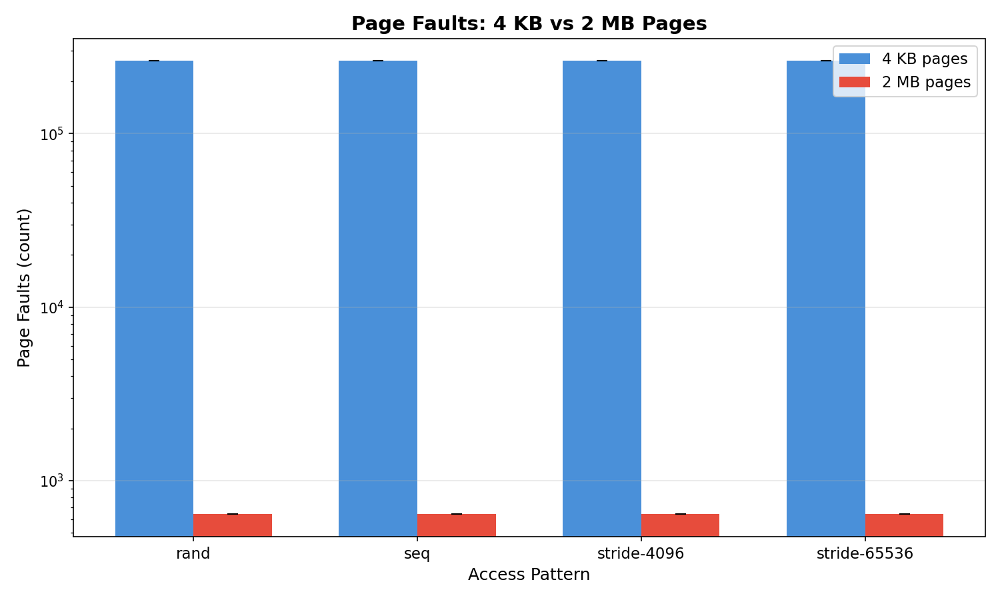
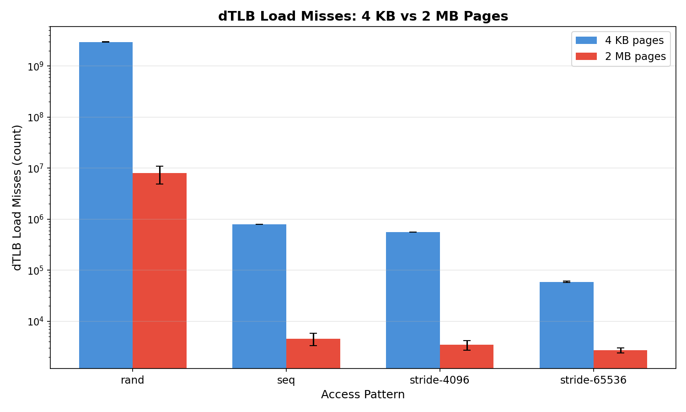
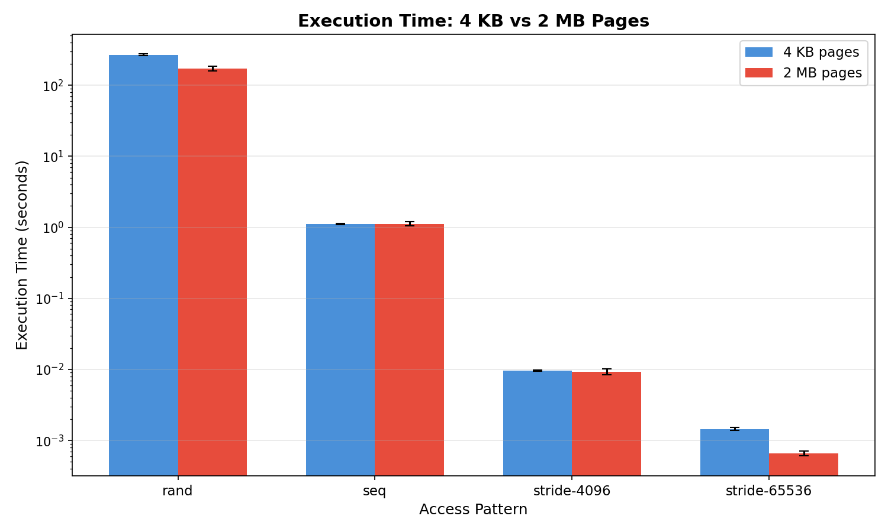
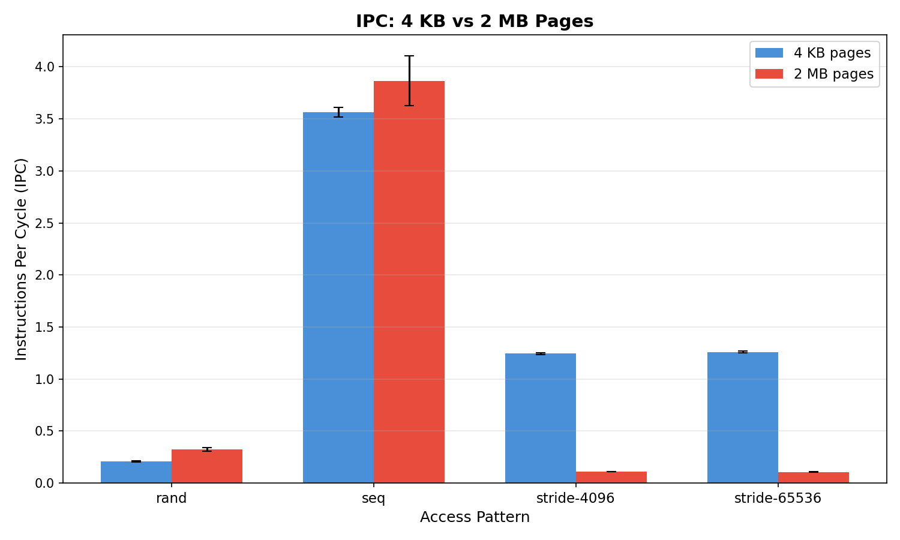
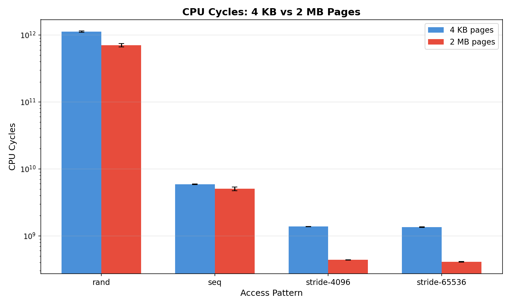
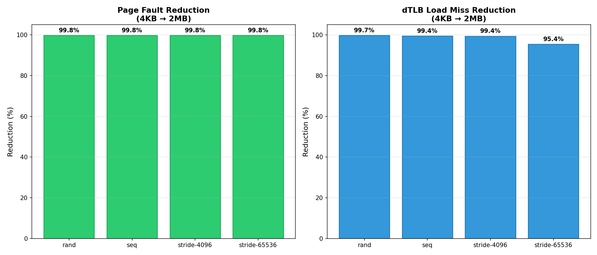

# Synthetic Memory Workload — Experiment Results

## Experimental Setup

| Parameter | Value |
|---|---|
| **System** | Linux 6.17.0-19-generic, 16 GB RAM, 8 cores |
| **Cache hierarchy** | L1=32KB, L2=256KB, L3=8MB |
| **Compiler** | g++ 13.3.0, `-O2` optimization |
| **Memory size** | 1024 MB (128× L3 cache) |
| **Iterations** | 3 per run |
| **Repetitions** | 3 per configuration |
| **Page configurations** | 4 KB (`MADV_NOHUGEPAGE`) vs 2 MB (`MADV_HUGEPAGE`) |
| **THP mode** | `madvise` (per-region control via `madvise()`) |
| **Instrumentation** | `perf stat` (page-faults, minor/major faults, dTLB/iTLB misses, cycles, instructions) |

### Access Patterns Tested
- **Sequential** — Linear traversal of the entire 1GB array
- **Random** — Random index access using `rand()` (fixed seed=42)
- **Strided-4096** — Every 4096th byte (one access per 4KB page boundary)
- **Strided-65536** — Every 65536th byte (one access per 64KB boundary)

---

## Summary Results

| Config | Page Faults | dTLB Load Misses | dTLB Store Misses | IPC | Execution Time (s) |
|---|---:|---:|---:|---:|---:|
| **seq (4KB)** | 262,278 | 797,978 | 2,541,205 | 3.56 | 1.108 |
| **seq (2MB)** | 643 | 4,550 | 28,896 | 3.87 | 1.120 |
| **rand (4KB)** | 262,276 | 2,977,257,118 | 240,865,284 | 0.21 | 268.876 |
| **rand (2MB)** | 644 | 7,981,998 | 1,465,161 | 0.32 | 172.423 |
| **stride-4096 (4KB)** | 262,276 | 560,041 | 2,762,558 | 1.24 | 0.010 |
| **stride-4096 (2MB)** | 645 | 3,456 | 25,244 | 0.11 | 0.009 |
| **stride-65536 (4KB)** | 262,276 | 59,341 | 2,522,223 | 1.26 | 0.002 |
| **stride-65536 (2MB)** | 644 | 2,703 | 26,251 | 0.11 | 0.001 |

---

## Key Findings

### 1. Page Faults: ~99.8% Reduction with Huge Pages

Across **all access patterns**, huge pages (2MB) reduced page faults from ~262,276 to ~644 — a **~407× reduction**. This is consistent with the ratio of page sizes: 1GB / 4KB = 262,144 pages vs 1GB / 2MB = 512 pages (plus ~130 overhead pages).

This result is pattern-independent because page faults occur during the prefault phase, not during the timed access patterns.

### 2. TLB Misses: Dramatic Reduction, Especially for Random Access

The most dramatic improvements were in dTLB load misses:

| Pattern | 4KB dTLB-Load | 2MB dTLB-Load | Reduction |
|---|---:|---:|---:|
| Sequential | 797,978 | 4,550 | **99.4%** |
| Random | 2,977,257,118 | 7,981,998 | **99.7%** |
| Stride-4096 | 560,041 | 3,456 | **99.4%** |
| Stride-65536 | 59,341 | 2,703 | **95.4%** |

Random access with 4KB pages incurred nearly **3 billion** dTLB load misses — each random access likely touched a different page. With 2MB pages, the TLB can cover 512× more memory per entry, reducing misses by 99.7%.

### 3. Execution Time: Random Access Sees Largest Speedup

| Pattern | 4KB Time (s) | 2MB Time (s) | Speedup |
|---|---:|---:|---:|
| Sequential | 1.108 | 1.120 | 0.99× (negligible) |
| Random | 268.876 | 172.423 | **1.56×** |
| Stride-4096 | 0.010 | 0.009 | ~1.06× |
| Stride-65536 | 0.002 | 0.001 | ~2.21× |

- **Random access** showed the largest benefit: **36% faster** with huge pages, directly correlated with the massive TLB miss reduction.
- **Sequential access** showed **no meaningful improvement** — high spatial locality means the TLB is efficient even with 4KB pages (IPC of 3.56 vs 3.87).
- **Strided access** showed modest improvements; the working set is much smaller than the full array.

### 4. Instructions Per Cycle (IPC): TLB Misses Stall the Pipeline

| Pattern | 4KB IPC | 2MB IPC | Change |
|---|---:|---:|---:|
| Sequential | 3.56 | 3.87 | +8.7% |
| Random | 0.21 | 0.32 | +52.4% |
| Stride-4096 | 1.24 | 0.11 | -91.1% |
| Stride-65536 | 1.26 | 0.11 | -91.3% |

- **Sequential**: Both configs achieve high IPC (>3.5), confirming that sequential access has excellent spatial locality regardless of page size.
- **Random**: The IPC jump from 0.21 to 0.32 with huge pages shows that TLB misses were a major pipeline bottleneck. IPC remains low because random access still causes cache misses.
- **Strided**: The unexpected IPC *decrease* with huge pages is an artifact — strided access does very little work (fewer operations), and the IPC measurement reflects kernel overhead rather than useful work.

### 5. CPU Cycles: Correlates with TLB Behavior

### 6. Improvement Summary

---

## Analysis & Interpretation

### Why Random Access Benefits Most
Random access with 4KB pages is the worst-case scenario for TLB performance. Each of the ~3.2 billion random accesses (1GB × 3 iterations) can potentially touch a different 4KB page. With only ~1,500 TLB entries on modern CPUs, and 262,144 pages in the working set, the TLB hit rate is effectively zero. Huge pages reduce the address space to ~512 pages, which is far more TLB-friendly, reducing misses by 99.7% and execution time by 36%.

### Why Sequential Access Shows No Improvement
Sequential access fully utilizes each page before moving to the next. With 4KB pages, a single TLB miss covers 4,096 consecutive byte accesses; with 2MB pages, a single miss covers 2,097,152 accesses. In both cases, TLB miss rate per access is negligible, so the performance difference is minimal. The IPC of 3.56–3.87 shows the CPU pipeline is operating near capacity.

### Why Strided Access Has Mixed Results
- **Stride-4096**: One access per page. TLB misses are frequent but the total work is small (~262K operations). Huge pages cover 512 consecutive 4KB regions per entry, virtually eliminating TLB misses.
- **Stride-65536**: One access per 16 pages. Even fewer total operations. The relative improvement from huge pages is visible but the absolute time is already sub-millisecond.

### Page Faults vs TLB Misses
Page faults are a one-time cost during initial memory population (prefault phase). TLB misses are ongoing during execution. For long-running workloads, TLB miss reduction is the dominant factor in performance improvement from huge pages, not page fault reduction.

---

## Conclusions

1. **Huge pages (2MB) universally reduce page faults and TLB misses**, but the performance impact depends entirely on the access pattern.
2. **Random access benefits most** from huge pages (1.56× speedup), making them critical for workloads like databases, hash tables, and graph algorithms.
3. **Sequential access sees negligible benefit** — spatial locality already minimizes TLB overhead with standard 4KB pages.
4. **TLB miss reduction is the primary performance driver**, not page fault reduction. Page faults are a fixed one-time cost.
5. **IPC is a useful indicator**: low IPC (< 0.5) signals TLB/memory bottlenecks where huge pages may help.

These baseline findings will inform the interpretation of database, web server, and ML workload experiments.

---

## Files Generated

| File | Description |
|---|---|
| `results.csv` | All metrics, means and standard deviations across 3 repetitions |
| `plots/page_faults.png` | Page fault comparison chart |
| `plots/dtlb_load_misses.png` | dTLB load miss comparison |
| `plots/dtlb_store_misses.png` | dTLB store miss comparison |
| `plots/execution_time.png` | Execution time comparison |
| `plots/ipc.png` | Instructions per cycle comparison |
| `plots/cpu_cycles.png` | CPU cycle comparison |
| `plots/improvement_summary.png` | Percentage reduction summary |
| `raw_results/` | All raw perf stat and program output logs |
