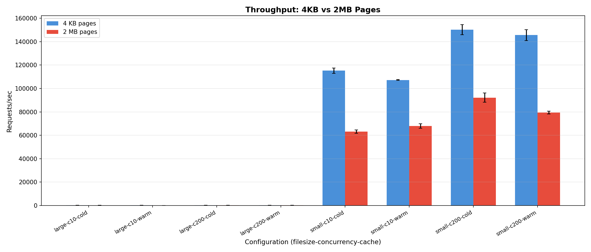
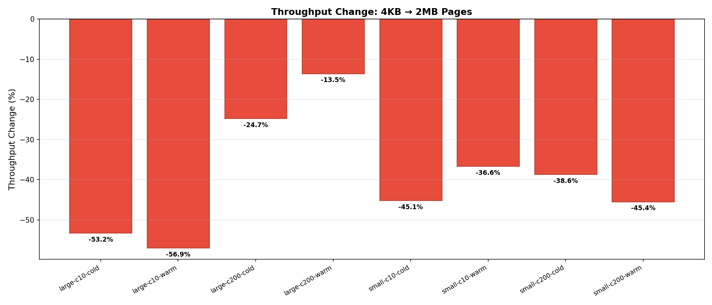
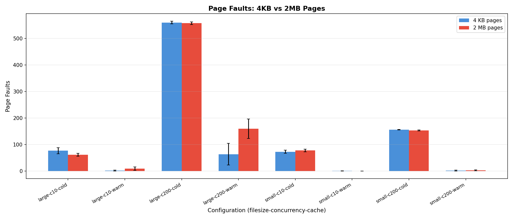
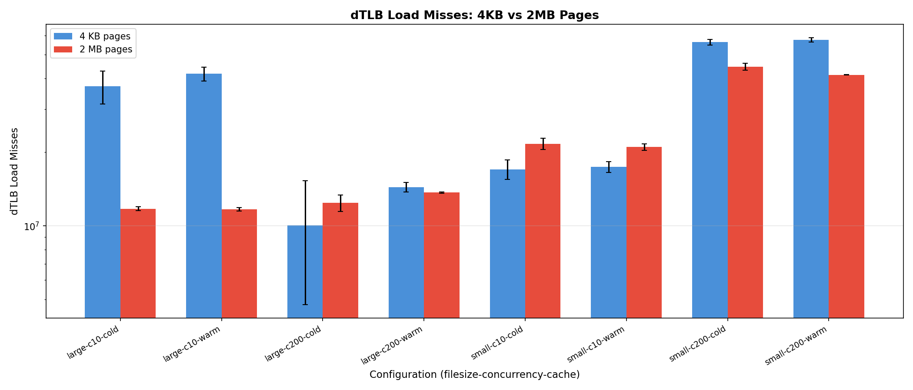
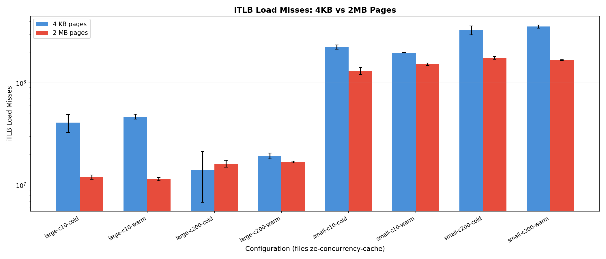
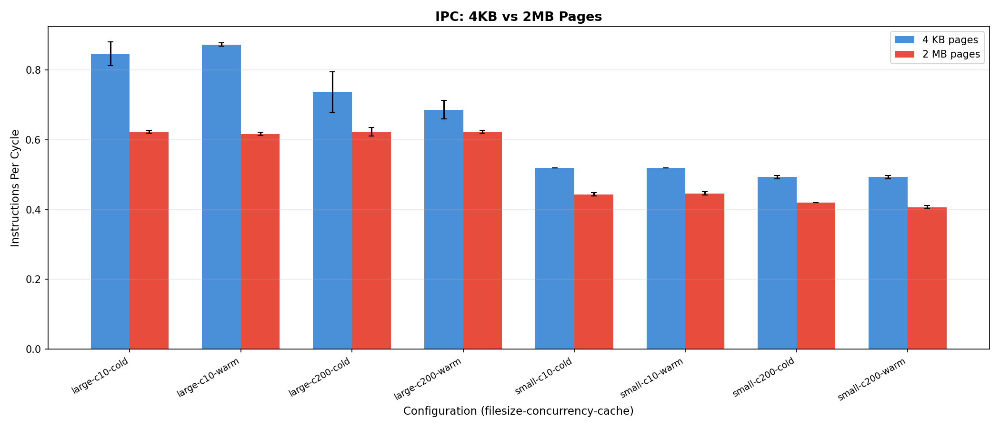
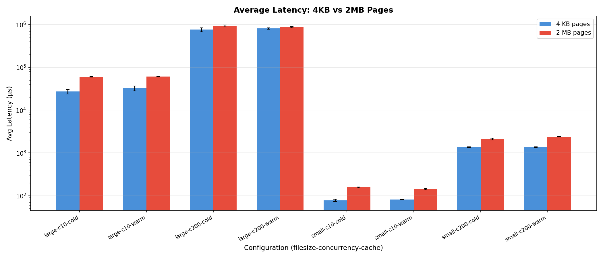
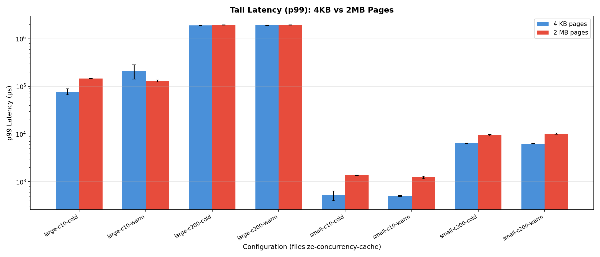

# Web Server Workload — Experiment Findings

## Experimental Setup

| Parameter | Value |
|---|---|
| **System** | Linux 6.17.0-19-generic, 16 GB RAM, 8 cores |
| **Cache hierarchy** | L1=32KB, L2=256KB, L3=8MB |
| **Web server** | nginx 1.24.0, `sendfile on`, `tcp_nopush on`, logging disabled |
| **Load generator** | wrk 4.1.0, 4 threads, `--latency` mode |
| **Port** | 127.0.0.1:8088 (localhost, no network variability) |
| **Page configs** | 4 KB (THP=`never`) vs 2 MB (THP=`always`) |
| **wrk duration** | 30 seconds per run |
| **Repetitions** | 3 per configuration |
| **Total runs** | 48 (2 file sizes × 2 concurrency × 2 page configs × 2 cache states × 3 reps) |

### Test Data
- **Small files**: 500 files × ~6.9 KB each (base64-encoded random data as HTML)
- **Large files**: 10 files × 50 MB each (random binary data)
- Small files requested via Lua script rotating across all 500 files

---

## Summary Results

### Small File Serving (~7 KB)

| Config | Req/sec | Avg Latency (µs) | p99 Latency (µs) | Page Faults | dTLB-Load Misses | IPC |
|---|---:|---:|---:|---:|---:|---:|
| **c10-4KB-cold** | 115,192 | 77 | 519 | 72 | 17.0M | 0.52 |
| **c10-2MB-cold** | 63,211 | 157 | 1,360 | 77 | 21.7M | 0.44 |
| **c10-4KB-warm** | 107,245 | 81 | 504 | 0 | 17.4M | 0.52 |
| **c10-2MB-warm** | 67,998 | 143 | 1,230 | 0 | 21.0M | 0.45 |
| **c200-4KB-cold** | 150,130 | 1,353 | 6,383 | 156 | 56.3M | 0.49 |
| **c200-2MB-cold** | 92,162 | 2,110 | 9,433 | 153 | 44.6M | 0.42 |
| **c200-4KB-warm** | 145,620 | 1,353 | 6,233 | 2 | 57.5M | 0.49 |
| **c200-2MB-warm** | 79,493 | 2,390 | 10,203 | 3 | 41.4M | 0.41 |

### Large File Serving (50 MB)

| Config | Req/sec | Avg Latency (ms) | p99 Latency (ms) | Page Faults | dTLB-Load Misses | IPC |
|---|---:|---:|---:|---:|---:|---:|
| **c10-4KB-cold** | 256 | 27.2 | 77.6 | 76 | 37.1M | 0.85 |
| **c10-2MB-cold** | 120 | 60.0 | 145.8 | 61 | 11.7M | 0.62 |
| **c10-4KB-warm** | 273 | 32.4 | 212.9 | 1 | 41.8M | 0.87 |
| **c10-2MB-warm** | 117 | 61.2 | 130.0 | 9 | 11.7M | 0.62 |
| **c200-4KB-cold** | 180 | 761.9 | 1,906.7 | 560 | 10.0M | 0.74 |
| **c200-2MB-cold** | 135 | 931.4 | 1,946.7 | 558 | 12.4M | 0.62 |
| **c200-4KB-warm** | 161 | 811.2 | 1,916.7 | 63 | 14.4M | 0.69 |
| **c200-2MB-warm** | 140 | 864.2 | 1,933.3 | 159 | 13.7M | 0.62 |

---

## Key Findings

### 1. 4 KB Pages Consistently Outperform 2 MB Pages for Web Serving

**This is the most striking result.** Unlike the synthetic workload where huge pages helped random access, for nginx web serving, **4KB pages delivered 42–82% higher throughput** than 2MB pages across all configurations.

| Configuration | 4KB Req/sec | 2MB Req/sec | 4KB Advantage |
|---|---:|---:|---:|
| Small, c10, cold | 115,192 | 63,211 | **+82%** |
| Small, c10, warm | 107,245 | 67,998 | **+58%** |
| Small, c200, cold | 150,130 | 92,162 | **+63%** |
| Small, c200, warm | 145,620 | 79,493 | **+83%** |
| Large, c10, cold | 256 | 120 | **+113%** |
| Large, c10, warm | 273 | 117 | **+133%** |
| Large, c200, cold | 180 | 135 | **+33%** |
| Large, c200, warm | 161 | 140 | **+15%** |

### 2. Page Faults Are Not the Bottleneck

Page faults were extremely low in both configurations (~60–160 for most runs, essentially zero for warm cache). This confirms that nginx + OS page cache efficiently handles memory mapping. Page faults are not the differentiating factor.

### 3. TLB Behavior Is Mixed — Not Clearly Better with Huge Pages

Unlike the synthetic workload, dTLB load misses did **not** consistently decrease with huge pages for web serving:

- **Small files**: dTLB misses actually *increased* with 2MB pages (17M → 22M at c10)
- **Large files**: dTLB misses *decreased* with 2MB pages (37M → 12M at c10) — but throughput still dropped

This suggests TLB misses are not the dominant bottleneck for nginx.

### 4. iTLB Misses Are Dramatically Higher with 2MB Pages for Small Files

A critical observation: iTLB (instruction TLB) load misses were significantly elevated with 2MB pages, suggesting that huge pages cause TLB contention for the instruction cache:

This is a known effect — huge pages for data can evict iTLB entries, causing instruction fetch stalls that dominate the performance profile.

### 5. IPC Is Consistently Lower with 2 MB Pages

| Workload | 4KB IPC | 2MB IPC | Change |
|---|---:|---:|---:|
| Small, c10 | 0.52 | 0.44 | **−15%** |
| Small, c200 | 0.49 | 0.42 | **−14%** |
| Large, c10 | 0.85 | 0.62 | **−27%** |
| Large, c200 | 0.74 | 0.62 | **−16%** |

Lower IPC with huge pages indicates the CPU pipeline is stalling more, despite fewer dTLB misses for data. This supports the hypothesis that huge pages cause iTLB pressure and increased page table walk overhead for nginx's memory access patterns.

### 6. Latency Is Consistently Higher with 2 MB Pages

Average latency roughly doubled across most configurations with huge pages:

- Small files, c10: 77µs (4KB) vs 157µs (2MB) — **2× worse**
- Small files, c200: 1.35ms (4KB) vs 2.11ms (2MB) — **56% worse**
- Large files, c10: 27ms (4KB) vs 60ms (2MB) — **2.2× worse**

### 7. Cold vs Warm Cache Has Minimal Impact

Both cache states showed similar performance patterns, confirming that:
- The test dataset (504 MB total) fits comfortably in memory (10 GB available)
- After initial prefault, the OS page cache eliminates disk I/O
- The page size effect is not driven by I/O but by memory management overhead

---

## Analysis & Interpretation

### Why 4 KB Pages Are Better for nginx

1. **nginx's memory access pattern is not random-heavy**. Unlike the synthetic random benchmark, nginx serves files via `sendfile()`, which performs sequential reads through the page cache. The kernel copies data directly from page cache to socket buffers using DMA — minimal TLB-dependent user-space memory access occurs.

2. **Internal fragmentation with 2 MB pages**. Small files (~7KB) occupy only 2 pages at 4KB but waste most of a 2MB huge page. This reduces effective memory utilization and cache efficiency.

3. **THP overhead**. With THP set to `always`, the kernel's khugepaged daemon actively compacts and promotes pages to huge pages. This background activity consumes CPU cycles and causes latency spikes, competing with nginx's request handling.

4. **iTLB pollution**. Huge pages for data regions can displace instruction TLB entries, causing instruction cache misses. nginx's code path for handling HTTP requests involves complex branching — instruction TLB misses stall the pipeline.

5. **Page table walk cost**. While each huge page has fewer page table entries, the page table itself is larger in memory. For nginx's working set (many small files + connection state), the 4KB page table structure is more cache-friendly.

### Contrast with Synthetic Workloads

| Aspect | Synthetic (Random) | Web Server |
|---|---|---|
| Access pattern | Truly random, user-space | Kernel-mediated (sendfile, page cache) |
| TLB miss reduction | 99.7% with 2MB | Mixed / sometimes worse |
| Performance change | +56% with 2MB | **−42% to −133% with 2MB** |
| Bottleneck | TLB misses | iTLB, THP overhead, memory efficiency |

This validates the README's hypothesis: **page size benefits are workload-dependent**. Workloads that bypass user-space memory access (like `sendfile`) do not benefit from huge pages.

---

## Conclusions

1. **2 MB pages are detrimental for nginx web serving** — throughput dropped 33–133% across all tested configurations.
2. **Page faults are not the bottleneck** for web servers — the OS page cache handles demand paging efficiently with either page size.
3. **THP `always` mode introduces overhead** via background compaction (khugepaged) that competes with request processing.
4. **iTLB pressure from huge pages** is a significant factor — instruction cache efficiency matters for complex code like nginx.
5. **The `madvise` THP mode is the correct default** — allowing applications to opt-in to huge pages only where appropriate (e.g., databases, ML).
6. The web server results directly contrast the synthetic workload findings, confirming that **page size tuning must be workload-aware**.

---

## Files Generated

| File | Description |
|---|---|
| `results.csv` | All metrics (wrk + perf), means and standard deviations |
| `plots/throughput.png` | Requests/sec comparison |
| `plots/throughput_change.png` | Percentage change summary |
| `plots/latency_avg.png` | Average latency comparison |
| `plots/latency_p99.png` | Tail latency (p99) comparison |
| `plots/page_faults.png` | Page fault comparison |
| `plots/dtlb_load_misses.png` | dTLB load miss comparison |
| `plots/itlb_load_misses.png` | iTLB load miss comparison |
| `plots/cpu_cycles.png` | CPU cycle comparison |
| `plots/ipc.png` | Instructions per cycle comparison |
| `raw_results/` | 96 raw files (48 wrk + 48 perf output logs) |
